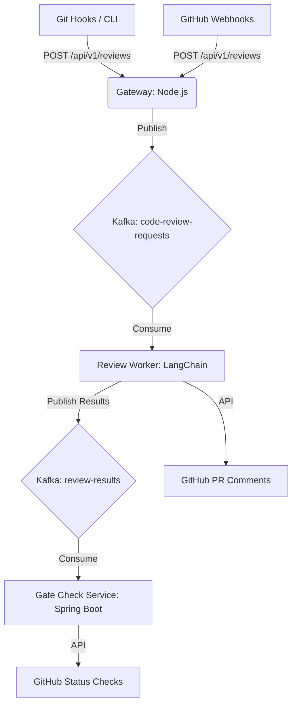

# 🔍 AI Code Review Platform

A high-scale microservices backend providing automated AI-powered code reviews, utilizing secure RESTful APIs and LangChain for intelligent feedback loops integrated via Git hooks.

## Architecture



## Services

| Service | Technology | Port | Description |
|---------|-----------|------|-------------|
| `gateway` | Node.js + Express | 3000 | REST API ingestion gateway |
| `review-worker` | Node.js + LangChain | - | Kafka consumer, AI review engine |
| `gate-service` | Java + Spring Boot | 8080 | Gate checks & metadata extraction |
| `cli` | Node.js | - | Developer CLI tool |

## Quick Start

### Prerequisites
- Node.js >= 18
- Java >= 17
- Docker & Docker Compose (for Kafka)

### 1. Start Infrastructure
```bash
docker-compose up -d
```

### 2. Install & Run Services
```bash
# Gateway
cd services/gateway && npm install && npm run dev

# Review Worker
cd services/review-worker && npm install && npm run dev

# Gate Service
cd services/gate-service && ./gradlew bootRun
```

### 3. Install CLI
```bash
cd cli && npm install && npm link
```

### 4. Run a Review
```bash
# Review staged changes
ai-review review --staged

# Review a specific commit
ai-review review --commit HEAD~1

# Review a PR
ai-review review --pr https://github.com/org/repo/pull/1
```

## Configuration

### Environment Variables

Each service requires specific environment variables to operate. Create a `.env` file in the root of each service.

**Gateway (`services/gateway/.env`)**
```env
PORT=3000
KAFKA_BROKERS=localhost:19092
CORS_ORIGIN=*
RATE_LIMIT_WINDOW_MS=900000
RATE_LIMIT_MAX=100
```

### Local Config File

Create a `.ai-review.yaml` in your project root:

```yaml
llm:
  provider: openai       # openai | anthropic | gemini
  model: gpt-4o
  temperature: 0.2

review:
  categories:
    - security
    - performance
    - code-quality
    - best-practices
  severity_threshold: WARNING  # CRITICAL | WARNING | INFO

gate_checks:
  max_critical_issues: 0
  max_warnings: 5
  require_tests: true
```

## License

MIT
